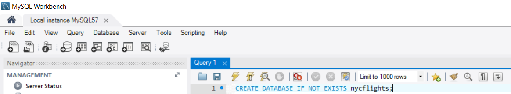
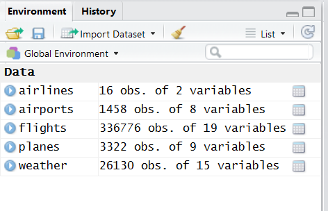
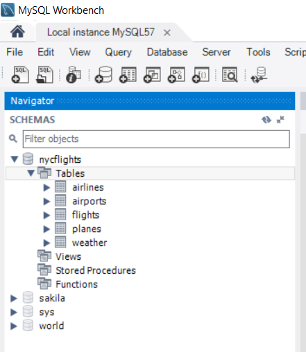
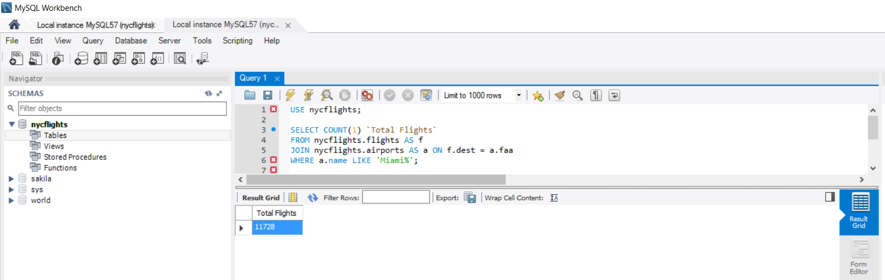
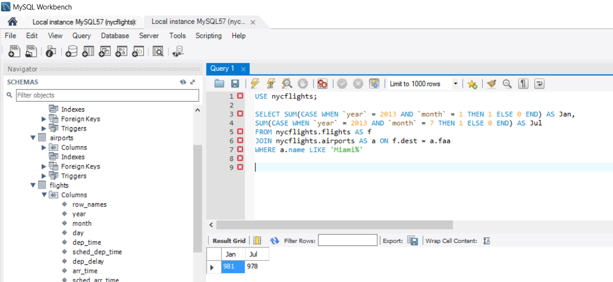

This exercise is an hands-on lab to connect MySQL database. This lab has exposed me to tools including MySQL workbench, MySQL database server, R and R Studio. Download data files with extension .rda from the website and save them into data folder under current working directory.
```
https://github.com/hadley/nycflights13/tree/master/data
```
Packages used in this lab are.

```
install.packages("DBI")

install.packages("RMySQL")
```

Local MySQL server is required to complete this exercise. Download and install MySQL server from 
```
https://dev.mysql.com/downloads/mysql/. 
```
Open MySQL Workbench and execute following command in query window.



```
CREATE DATABASE IF NOT EXISTS nycflights;
```
Load following libraries to connect to MySQL local server and load data from .rda files.

```{r , echo=TRUE}
library(DBI)

library(RMySQL)

```

Open all the 5 files downloaded to data directory. Data frames airlines, airports, flights, planes and weather should appear inside environment window.

```{r , echo=TRUE}
load("data/airlines.rda")

load("data/airports.rda")

load("data/flights.rda")

load("data/planes.rda")

load("data/weather.rda")
```



Create a MySQL database connection and save the handle to a variable. For the purpose of lab in left password blank.

```{r , echo = TRUE}
dbhandle <- dbConnect(MySQL(),user = 'root',password = '',host = 'localhost',dbname='nycflights')
```

Load the tables into MySQL *nycflights* database.

```{r , echo=TRUE, warning = FALSE}
wt <- dbWriteTable(conn = dbhandle, name = 'airports', value = as.data.frame(airports))

wt <- dbWriteTable(conn = dbhandle, name = 'airlines', value = as.data.frame(airlines))

wt <- dbWriteTable(conn = dbhandle, name = 'flights', value = as.data.frame(flights))

wt <- dbWriteTable(conn = dbhandle, name = 'planes', value = as.data.frame(planes))

wt <- dbWriteTable(conn = dbhandle, name = 'weather', value = as.data.frame(weather))

```

Once execution is completed, close the connection. On MySQL server *nycflights* database should show all 5 tables as shows in the figure below.

```{r , echo=TRUE}
dc <- dbDisconnect(dbhandle)
```



Execute all the below queries in MySQL Workbench.

Q 1: Write a SELECT statement that returns all of the rows and columns in the planes table

A: 
```
USE nycflights;

SELECT * FROM nycflights.planes;
```

Q 2: Using the weather table, concatenate the year, month, and day columns to display a date in the form "3/17/2013".

A:
```
USE nycflights;

SELECT concat(`month`,"/",`day`,"/",`year`) `Date`,`month`,`day`,`year` FROM nycflights.weather;
```

Q 3: Order by planes table by number of seats, in descending order.

A:
```
USE nycflights;

SELECT * FROM nycflights.planes ORDER BY seats;
```

Q 4: List only those planes that have an engine that is 'Reciprocating'

A:
```
USE nycflights;

SELECT * FROM nycflights.planes WHERE engine = 'Reciprocating';
```

Q 5: List only the first 5 rows in the flights table

A:
```
USE nycflights;

SELECT * FROM nycflights.flights LIMIT 5;
```

Q 6: What was the longest (non-blank) air time?

A: Longest air time is 695.
```
USE nycflights;

SELECT MAX(air_time) FROM nycflights.flights;
```

Q 7: What was the shortest (non-blank) air time for Delta?

A: Shortest air time is 20.
```
USE nycflights;

SELECT MIN(air_time) 
FROM nycflights.flights AS f
JOIN nycflights.airlines AS a
WHERE a.name LIKE '%Delta%';
```

Q 8: Show all of the Alaska Airlines flights between June 1st, 2013 and June 3rd, 2013. Is the way the data is stored in the database helpful to you in making your query?

A: As airlines information is stored in separate table a join is necessary between tables flights and airlines. Since date is separated into month, day and year columns it is easier to extract the data. 

```
USE nycflights;

SELECT f.* 
FROM nycflights.flights as f 
JOIN nycflights.airlines as a ON f.carrier = a.carrier 
WHERE a.name = 'Alaska Airlines Inc.'
AND `year` = 2013
AND `month` = 6
AND `day` BETWEEN 1 AND 3;
```

Q 9: Show all of the airlines whose names contain 'America'

A:
```
USE nycflights;

SELECT * FROM nycflights.airlines WHERE name LIKE '%AMERICA%';
```
Q 10. How many flights went to Miami?

A: Total of 11728 flights went to Miami.

```
USE nycflights;

SELECT COUNT(1) `Total Flights`
FROM nycflights.flights AS f
JOIN nycflights.airports AS a ON f.dest = a.faa
WHERE a.name LIKE 'Miami%';
```


Q 11: Were there more flights to Miami in January 2013 or July 2013? (Multiple queries are OK)

A: There were more flights in January. Total of 981 flights in Jan and 978 in Jul. 

```
USE nycflights;

SELECT SUM(CASE WHEN `year` = 2013 AND `month` = 1 THEN 1 ELSE 0 END) AS Jan,
SUM(CASE WHEN `year` = 2013 AND `month` = 7 THEN 1 ELSE 0 END) AS Jul
FROM nycflights.flights AS f
JOIN nycflights.airports AS a ON f.dest = a.faa
WHERE a.name LIKE 'Miami%';
```


Q 12: What is the average altitude of airports?

A: Average altitude of airports is 1001.45.

```
USE nycflights;

SELECT AVG(alt) FROM nycflights.airports;
```


References:
Using R With MySQL Databases by Jason A. French, Northern University http://www.jason-french.com/blog/2014/07/03/using-r-with-mysql-databases/
